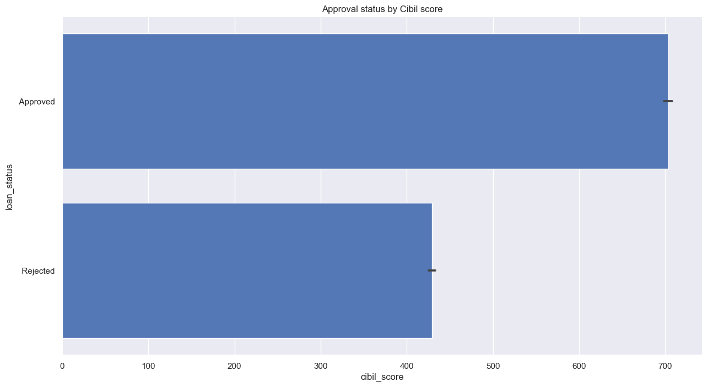

# Midterm-Project-loan-approval-analysis

### Created by: Yuchen He, Ethan Lam, Cynthia Okaja

## Project/Goals
To develop a model that will predict the likelihood of loan approval based on customer details such as gender, marital status, education, number of dependents, income, loan amount, credit history and others.

## Process
### Data collection from Kaggle
The dataset was selected from Kaggle (https://www.kaggle.com/datasets/architsharma01/loan-approval-prediction-dataset) for this project.
### Data Preprocessing
### EDA process for data visualization 

#### Check the value distribution

#### Check the relationship using Pairplot

#### Check the Outliers

#### Check correlation using Heatmap

### Data visualization using tableau
#### Approval Rate Dashboard

#### Approval Amount Dashboard

### Hypothesis testing
#### T-Test: Loan status and Cibil score
H0: `Loan status` has relationship with `Cibil score`
H1: `Loan status` has no relationship with `Cibil score`

#### Anova test:
#### Chi-squared test
`Education` and `Loan status`

### Modelling
#### Line Regression Model - Backward selection

#### Logistic Regression Model

## Results
- Produced two models with 86% and 77% accuracy of predicting loan approval status
- Loan term, cibil score have major effects on the approval

## Challenges 
- Trying to optimize models 
    - Selecting the “perfect” combination of features
- Using advanced features of Tableau
    - Forecasting: not available since the dataset does not contain temporal data
    - Casting data to correct data types

## Future Goals
- Stretch: determining whether the loan can be paid back in time
- Getting a more detailed dataset

